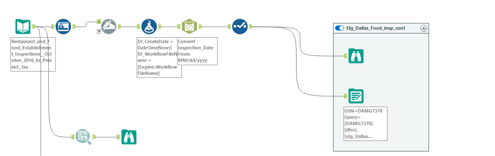
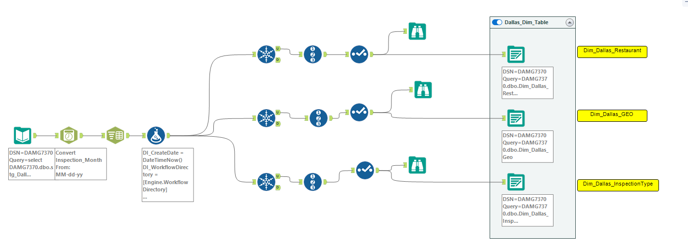
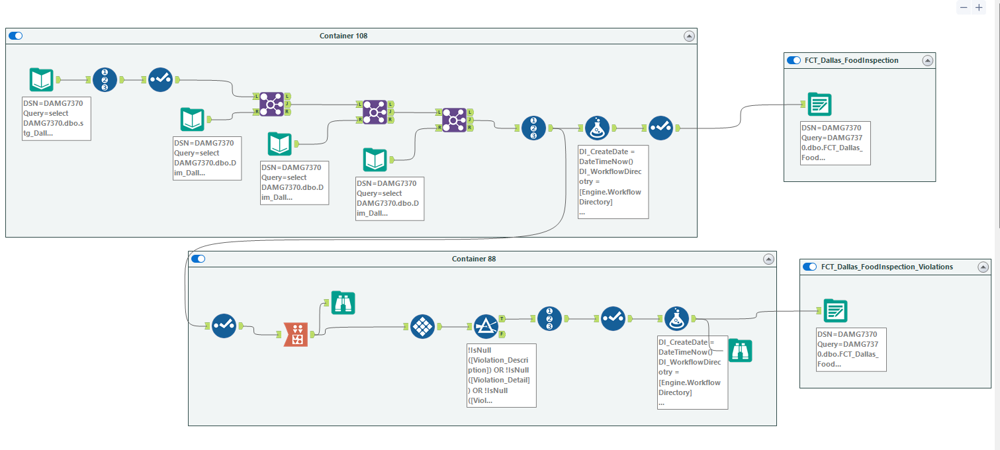
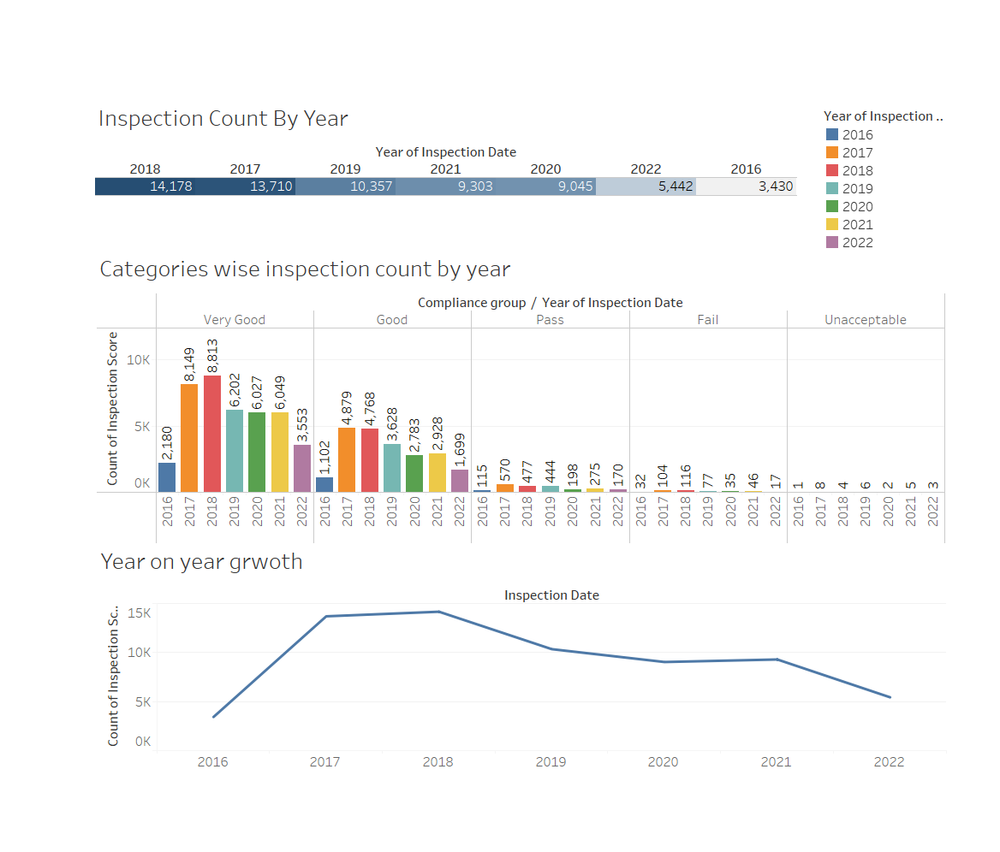
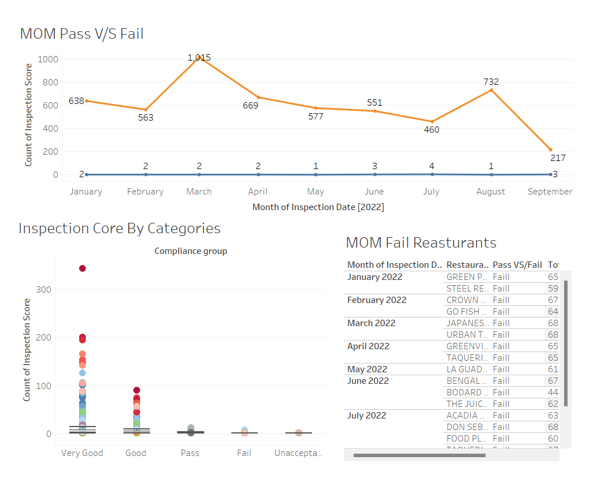
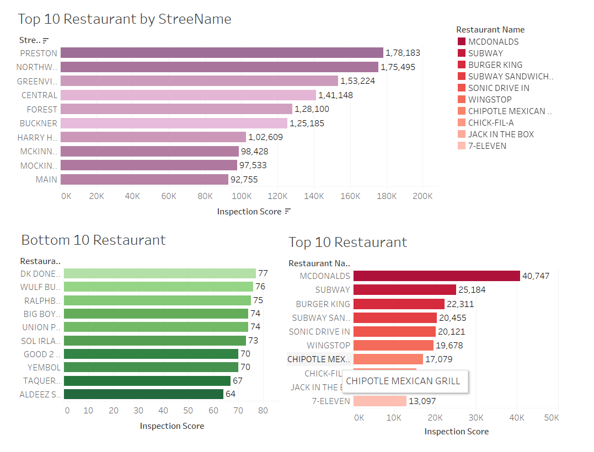

# Dallas_Food_Inspection_DataAnalysis
Dallas Food Inspection Data Analysis and Visualization

Data from Dallas food inspections were analyzed. Using Alteryx and Talend, I created a Dimensional Model for the provided dataset on Bigdata, and I built ETL pipelines to process, clean, and create dimensions and facts in the destination database. Furthermore, using Tableau and PowerBI, I visualized the necessary database details.

# Alteryx Workflow:
# --DataProfiling

# --DataPreparation_DimTable

# --DataPreparation_FactTable

## Dashboards ##
# --Inspection by Year

# --Pass V/s Fail %

# --Top and Bottom 10 Restaurants

